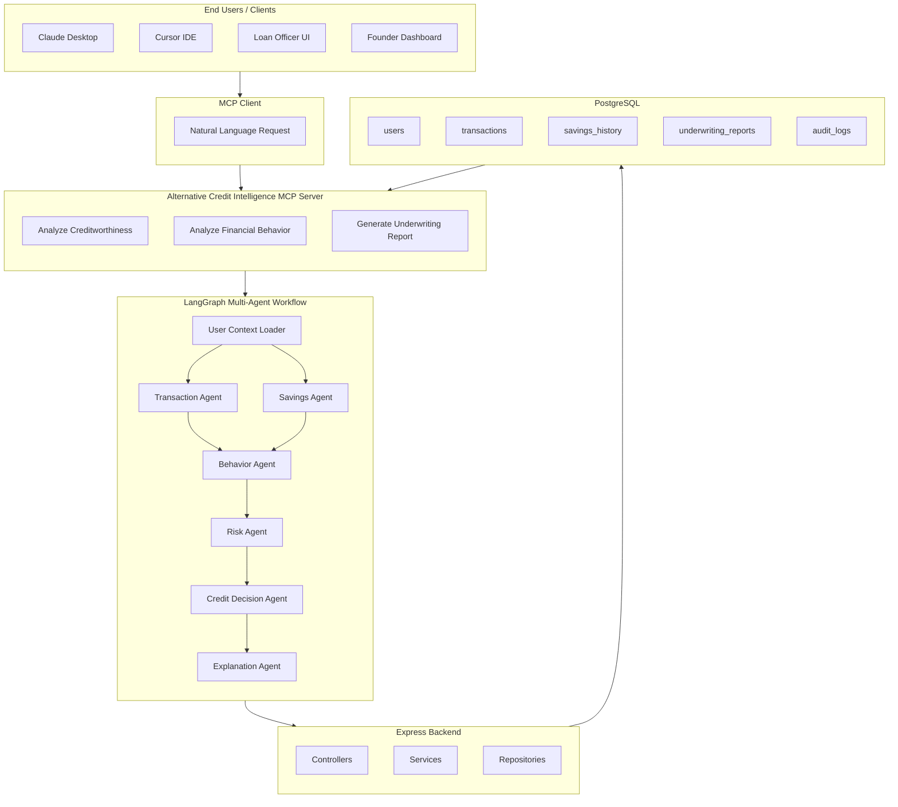
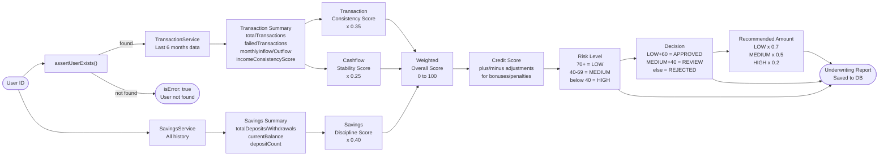
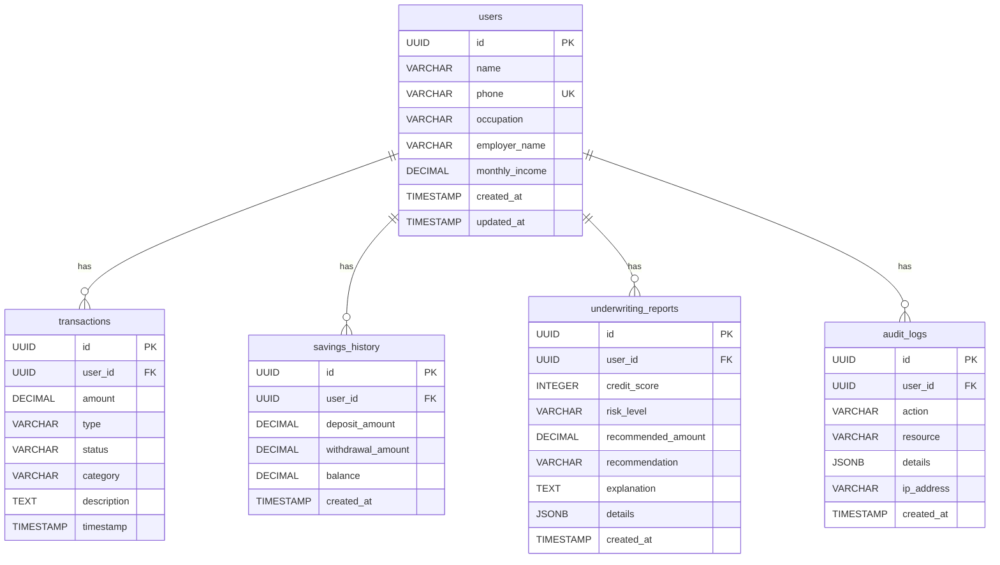
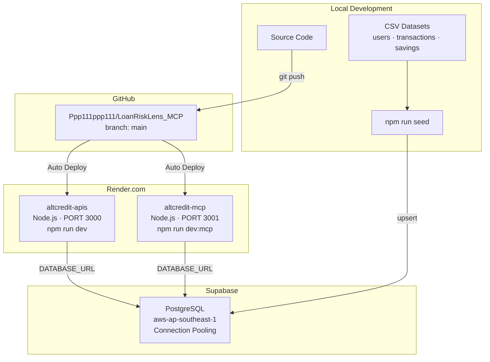

# 🏦 LoanRiskLens — Alternative Credit Intelligence Platform

> **Can we safely lend money to this customer?**

LoanRiskLens is a production-grade **Alternative Credit Intelligence** platform for fintech underwriting. It evaluates behavioral financial data to make explainable lending decisions — without requiring CIBIL scores, salary slips, ITR, or formal employment history.

[](https://altcredit-apis.onrender.com/api/health)
[](https://altcredit-mcp.onrender.com/health)
[](https://modelcontextprotocol.io)
[](./LICENSE)

---

## 📋 Table of Contents

- [Business Context](#business-context)
- [System Architecture](#system-architecture)
- [Credit Scoring Pipeline](#credit-scoring-pipeline)
- [Database Schema](#database-schema)
- [Deployment Architecture](#deployment-architecture)
- [MCP Client Setup](#mcp-client-setup)
- [API Reference](#api-reference)
- [Quick Start](#quick-start)
- [Tech Stack](#tech-stack)

---

## Business Context
Business Problem
#The Problem
Millions of self-employed and non-salaried people—including kirana shop owners, delivery partners, taxi drivers, freelancers, street vendors, and small merchants—are rejected for loans because they lack traditional credit indicators such as salary slips, formal employment records, or a CIBIL history.

As a result:
Good borrowers are rejected despite healthy financial habits.
Loan officers spend significant time manually reviewing applications.
Fintech companies struggle to distinguish trustworthy borrowers from risky ones.
Credit decisions are often inconsistent and difficult to explain.

Traditional underwriting relies on historical credit records instead of actual financial behavior, leaving a large underserved population without fair access to credit.


#Solution
Fintech companies serving **self-employed and informal-income customers** need to underwrite users who lack:
- Traditional CIBIL/credit scores
- Salary slips or formal ITR
- Long credit history

LoanRiskLens analyzes **behavioral financial signals** instead:

| Signal | What it measures |
|--------|-----------------|
| Transaction consistency | Regularity of income deposits |
| Savings discipline | Deposit vs withdrawal ratio |
| Cash-flow stability | Monthly inflow/outflow balance |
| Failed transaction rate | Payment reliability |
| Withdrawal behavior | Large/frequent cash-out patterns |
| Liquidity buffer | Emergency fund availability |

**Output:** `APPROVED` / `REVIEW` / `REJECTED` with recommended loan amount and human-readable explanation.

The MCP Server exposes this intelligence through standardized MCP tools, allowing AI assistants such as Claude Desktop, Cursor, and internal fintech applications to perform explainable credit analysis.
---
## System Architecture



## Credit Scoring Pipeline



### Scoring Formula

```
Credit Score = (Transaction Consistency × 0.35)
             + (Savings Discipline     × 0.40)
             + (Cashflow Stability     × 0.25)
```

### Risk & Decision Table

| Score | Risk Level | Decision | Max Loan |
|-------|-----------|----------|----------|
| ≥ 70  | `LOW`     | **APPROVED** | Up to ₹2,00,000 |
| 40–69 | `MEDIUM`  | **REVIEW**   | Up to ₹75,000  |
| < 40  | `HIGH`    | **REJECTED** | Not applicable |

---

## Database Schema



---

## Deployment Architecture



---

## MCP Client Setup

Add to your MCP client config — works with **Claude Desktop**, **Cursor**, and any MCP-compatible client:

```json
{
  "mcpServers": {
    "LoanRiskLens": {
      "url": "https://altcredit-mcp.onrender.com/mcp"
    }
  }
}
```

| Client | Config File (macOS) |
|--------|---------------------|
| Claude Desktop | `~/Library/Application Support/Claude/claude_desktop_config.json` |
| Cursor | `~/.cursor/mcp.json` |

### Available MCP Tools

| Tool | Description |
|------|-------------|
| `analyze_creditworthiness` | Credit score, risk level, loan amount, decision |
| `analyze_financial_behavior` | Behavior profile, savings score, cashflow, withdrawal pattern |
| `generate_underwriting_report` | Full report — all of the above + score breakdown, saved to DB |

### Example Prompts for Claude

```
Analyze the creditworthiness of user 550e8400-e29b-41d4-a716-446655440001

Generate a full underwriting report for user ID 550e8400-e29b-41d4-a716-446655440001

Check the financial behavior profile of user 85919b78-ec7d-4d17-8e67-6a02ebfca84a
```

> **Note:** Render free tier may take 30–60 seconds on first request after inactivity (cold start).

---

## API Reference

### Credit Endpoints

| Method | Endpoint | Description |
|--------|----------|-------------|
| `GET` | `/api/credit/analyze/:userId` | Run creditworthiness analysis |
| `GET` | `/api/credit/behavior/:userId` | Get financial behavior profile |
| `POST` | `/api/credit/report/:userId` | Generate & save underwriting report |

### Other Endpoints

| Method | Endpoint | Description |
|--------|----------|-------------|
| `GET` | `/api/health` | API health check |
| `GET` | `/api/users/:id` | Get user profile |
| `GET` | `/api/transactions/:userId` | List user transactions |
| `GET` | `/api/savings/:userId` | List savings history |

---

## Quick Start

```bash
# 1. Clone and install
git clone https://github.com/Ppp111ppp111/LoanRiskLens_MCP.git
cd LoanRiskLens_MCP
npm install

# 2. Configure environment
cp .env.example .env
# Edit .env — set DB_HOST, DB_NAME, DB_USER, DB_PASSWORD

# 3. Initialize schema and seed demo data
npm run seed

# 4. Start API server (port 3000)
npm run dev

# 5. Start MCP server (port 3001, separate terminal)
npm run dev:mcp

# 6. Run tests
npm test
```

### Project Structure

```
LoanRiskLens_MCP/
├── apps/
│   └── api/                    # Express REST API (port 3000)
│       ├── src/controllers/    # Route handlers
│       ├── src/services/       # Business logic (creditService, etc.)
│       ├── src/repositories/   # DB access layer
│       └── src/middleware/     # Auth, security, error handling
├── packages/
│   └── mcp-server/             # HTTP JSON-RPC MCP Server (port 3001)
│       ├── src/server/         # mcpServer.js — JSON-RPC router
│       └── src/tools/          # creditTools.js — tool definitions
├── credit-engine/              # Pure scoring & analysis logic
│   ├── src/scoring/            # Score calculators
│   └── src/analysis/           # Risk classifier, profile analyzer
├── langgraph-workflows/        # 6-agent sequential workflow
│   ├── src/agents/             # Individual agent classes
│   └── src/workflows/          # CreditIntelligenceWorkflow
├── shared/                     # Common modules
│   ├── src/config/             # App configuration
│   ├── src/database/           # pg Pool + schema init
│   └── src/utils/              # helpers, logger, validator
├── scripts/
│   └── seed-datasets.js        # CSV → PostgreSQL seed script
└── docs/                       # Documentation
```

---

## Tech Stack

| Layer | Technology |
|-------|-----------|
| Runtime | Node.js 18+ |
| API Framework | Express.js |
| Protocol | MCP (Model Context Protocol) — HTTP JSON-RPC 2.0 |
| Agent Workflow | LangGraph-style 6-agent pipeline |
| Database | PostgreSQL (Supabase hosted) |
| Authentication | JWT + RBAC |
| Validation | Joi |
| Logging | Winston |
| Testing | Jest |
| Deployment | Render.com (auto-deploy from GitHub) |

---

## Documentation

| Doc | Description |
|-----|-------------|
| [Agent Context Guide](docs/AGENT_CONTEXT.md) | Business context, demo questions, expected results |
| [Setup Guide](docs/SETUP.md) | Local development setup |
| [Architecture](docs/ARCHITECTURE.md) | Detailed technical architecture |
| [LangGraph Workflows](docs/LANGGRAPH.md) | Agent pipeline details |
| [MCP Integration](docs/MCP_INTEGRATION.md) | MCP server integration guide |
| [API Documentation](docs/API.md) | Full API reference |

---


